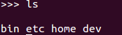
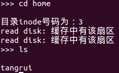
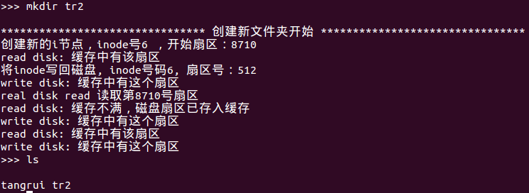
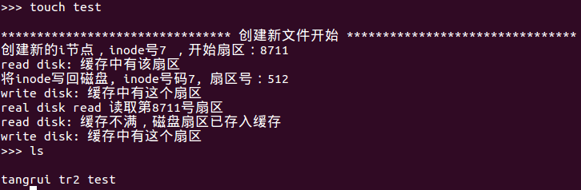
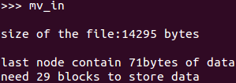
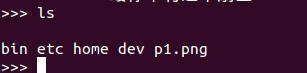
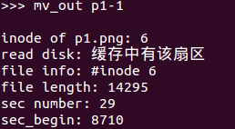
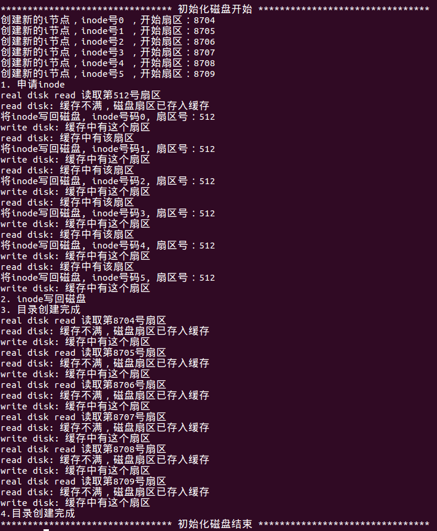
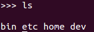

## 操作系统课程设计—模拟文件系统
- 学号：1452215
- 姓名：汤瑞

输入`make`编译，可执行文件是`./bin/filesystem`。进入系统后输入`reformat`格式化系统。

## 一、设计
将一个大文件当作是模拟的硬盘，包括三个区域：superblock, inode, 扇区。

文件 disk.img 共100MB，按照每个扇区 512B 来计算，共有204800个扇区。


### 二、superblock
记录inode和扇区的分配情况。占用512(256KB)个扇区,。使用位图的形式来记录inode和数据区的分配情况。

256个扇区来记录inode的分配情况，inode共占用8192个扇区。也就是用了4MB的磁盘来存放inode。

256个扇区来记录数据扇区的分配情况，数据扇区共131072个扇区。也就是说磁盘中64MB用来存放数据。

类定义及其解析如下：
``` c++
class superblock{
private:
  bool inode_bitmap[INODE_NUM];
  bool block_bitmap[BLOCK_NUM];

public:
  // 剩余的inode数量
  int remain_inode();

  // 剩余的扇区数量
  int remain_sec();

  // 返回未使用的i节点
  int get_new_inode();

  // 返回未使用的扇区
  int get_new_sec();

  // 回收i节点
  bool recv_inode(int inode_num);

  // 回收扇区
  bool recv_sec(int sec_num);

  // 初始化位图全都清0
  superblock();

  // 格式化
  bool init();
};
```

### 三、inode
记录文件和目录的信息,和占用的数据扇区的信息。每个inode节点32字节，一个扇区可以存放16个inode节点。共占用了8192个扇区。

``` c++
class Inode{
private:
    // inode号
  int _inode_num;
    // 是否是文件
  bool  _is_file;
    // 文件大小，单位为Byte
  int _file_size;                           
    // 数据扇区号码，只指定第一个，后面的通过指针连接  
  int _sec_beg;                           
    // 占用的数据扇区数量  
  int _sec_num;                    
   // 填充位，目的是将inode大小控制在32个字节       
  char _compensate[12];            

public:
  // 构造函数初始化
  Inode();

  // 构造函数
  Inode(int node_num, bool _is_file, int file_size, int sec_begin);

  // 获得inode号码
  int get_inode_num();

  // true->file; false->dir
  bool get_type();

  // 获得文件长度
  int get_file_size();

  // 获得起始磁盘扇区号
  int get_sec_beg();

  // 获得占据的磁盘扇区数量
  int get_sec_num();

  // 设置inode号
  void set_inode_num(int num);

  // 返回Inode对应的扇区号
  int get_inode_sec_num();

  // 从磁盘中读取inode
  bool read_inode_from_disk(int inode_num, Buffer& buffer);

  // 将inode写回到磁盘中
  bool write_inode_back_to_disk(Buffer& buffer);

  // 重载复制运算符
  Inode operator = (const Inode& b) {
  }
};
```

inode包括这样几个信息:

1. inode号码，这与目录中的inode号码对应
2. 文件类型，是目录还是文件
3. 文件大小，文件的具体大小
4. 文件起始扇区号
5. 文件占用的扇区数量

其中，0号inode是根目录`/`,根据根目录的数据扇区号，可以找到磁盘中对该文件夹的描述。

### 四、数据扇区
存放文件和目录信息，两者会有比较大的区别。

``` c++
// 目录项
struct sector_dir_entry{                                 
    // 目录名
  char name[28];                                             
    // 目录项对应的inode号码
  int inode_num;                             
    // 初始化
  void init(const char* _name, int _num);    
    // 构造函数
  sector_dir_entry();                                        
    // 重载赋值运算符
  sector_dir_entry operator = (const sector_dir_entry& dir);    
    // 和赋值运算符功能一样
  void clone(const sector_dir_entry& dir);                                  
};

// 512 Bytes.最后一项指示接下来的目录
class sector_dir{
public:
    // 构造函数
    sector_dir();

    // 将文件结构写回到磁盘中
    bool write_back_to_disk(Buffer& buffer, int sec_num);

    // 构造函数
    sector_dir operator = (const sector_dir& sec_dir);

    // 每个扇区有16项目录信息
    sector_dir_entry dirs[16];

    // 从磁盘中读取扇区，通过缓存buffer实现
    bool read_dir_from_disk(Buffer& buffer, int sec_num);
};

// 512 Bytes
class sector_file{
public:
    // 每个扇区能存放508字节数据
  char data[508];        
    // 指针指向下一个数据节点
  int next;                    

    // 构造函数
  sector_file();

    // 重载赋值运算符        
  sector_file operator = (const sector_file& sec_file);

     // 通过缓存buffer从磁盘中读取数据    
  bool read_dir_from_disk(Buffer& buffer, int sec_num);

    // 通过缓存将数据写回磁盘
  bool write_back_to_disk(Buffer& buffer, int sec_num);
};
```

#### 4.1文件
  每个扇区的前508个字节存放数据，最后一个字节指向下一个数据扇区，如果没有就置为-1。

  |字节|0 - 507|508 - 511|
  |--|--|--|
  |作用|存放数据|指向下一个数据扇区|

#### 4.2目录
  存放该目录下的文件名称和对应的文件indoe号码。例如：

##### 目录结构示例：
  |文件或目录名|对应的inode号码|
  |--|--|
  |.|1|
  |..|1|
  |bin|2|
  |etc|3|
  |home|4|
  |dev|5|
  |^|^|
  |next|next_num|

其中要求文件或目录名不超过28字节，后四位用来保存inode号码，如果一个扇区不够，最后一项指向下一个扇区。

根目录对应的inode为1。类似的`home`目录结构如下：

|文件或目录名|对应的inode号码|
|--|--|
|.|4|
|..|1|
|tr|6|
|^|^|

home自己的inode号为4，home目录上一层是根目录，对应inode为1。这个目录中有一个文件tr，其inode号码为6。


### 五、缓存
模拟磁盘的IO全部从这里经过。会动态地检查节点的状态，将长时间没用的缓存写回磁盘。

``` c++
/*******************************************
  缓存类, 模拟磁盘的IO全部从这里经过。
  会动态地检查节点的状态，将长时间没用的缓存写回磁盘
*******************************************/
// 缓存节点
struct BufferNode{
  // 长度                          
  char buffer[SEC_SIZE + 1];            // 长度为512 + 1个字节（为了保存字符串尾0）
  int pri;                                             // 缓存的优先级，缓存满了会将优先级最低的节点写回磁盘
  int sec_num;                                   // 对应的扇区号

    // 重载构造函数
  BufferNode operator = (const BufferNode& b) {
    memcpy(buffer, b.buffer, SEC_SIZE + 1);
    pri = b.pri;
    sec_num = b.sec_num;
  }
  BufferNode(){
    memset(buffer, 0, SEC_SIZE);
    pri = 0;
    sec_num = 0;
  }
  void init(int _sec_num) {
    pri = 5;
    sec_num = _sec_num;
  }
  void update(const BufferNode& b) {
    memcpy(buffer, b.buffer, SEC_SIZE + 1);
    pri = b.pri + 1;
    sec_num = b.sec_num;
  }
};

class Buffer{
  public:
      // 构造函数,打开文件
      Buffer();

      // 析构函数，关闭函数
      ~Buffer();

      // 将 buffer 里面的内容写入扇区中.单位为512KB。放入缓存队尾部。
      // 如果扇区已经存在于缓存中，则刷新扇区
      bool write_disk(const BufferNode& node);

      // 将扇区中的内容读入buffer中,首先会从缓存里找有没有这个节点。
      // 新读入缓存的节点优先级为5，如果存在于缓存中，则优先级加 1
      bool read_disk(int sec_num, BufferNode& node);

  private:

    // 真正操作文件
    bool real_disk_write(const BufferNode& node);

    // 真正操作文件
    bool real_disk_read(int sec_num, BufferNode& node);

    // 检查缓存中有没有给定扇区号的缓存
    int has_sec(int sec_number);

    // 返回优先级最低的缓存号码,没满返回0
    int is_full();


    // 磁盘缓存，共15个节点，满了之后会将优先级最低的节点写回磁盘
    vector<BufferNode> cache;
    // 静态的文件指针
    fstream disk;
};
```

### 六、实现以下文件API

``` c++
void ls();
int fopen(char* name, int mode);
void fclose(int fd);
int fread(int fd, char* buffer, int length);
int fwrite(int fd, char* buffer, int length);
int flseek(int fd, int position);
int fcreat(char* name, int mode);
int fdelete(char* name);
```


#### 1. ls命令
当前目录存放在cur_dir里面，所以只需遍历一边就可以输出目录
``` c++
// ls: 列出文件夹下所有文件夹及目录(cur_dir中所有的信息)
bool my_fs::list_dir() {
    for(int i = 2; i < 15; i++) {
        cout << cur_dir.dirs[i].name << " ";
    }
    cout << endl;
    return true;
}
```

##### 1.1 运行结果演示


#### 2. cd命令
进入某个目录
``` c++
// cd: 进入某个文件夹
bool my_fs::change_dir(const char* name) {
    // 1. 得到子目录的inode号码
    int dir_inode_num = -1;
    for(int i = 0; i < 15; i++) {
        if(strncmp(name, cur_dir.dirs[i].name, strlen(name)) == 0) {
            dir_inode_num = cur_dir.dirs[i].inode_num;
            cout << "目录inode号码为：" << dir_inode_num << endl;
            break;
        }
    }
    if(dir_inode_num == -1) {
        cout << "该目录不存在" << endl;
        return false;
    }

    // 2. 根据这个inode号码找到相应的inode
    cur_dir_node.read_inode_from_disk(dir_inode_num, my_cache);

    // 3. 根据inode中的信息区磁盘中读取目录信息
    cur_dir.read_dir_from_disk(my_cache, cur_dir_node.get_sec_beg());

    return true;
}
```
##### 2.1 运行演示



可以看到已经进入到home目录了

#### 3.mkdir命令
创建文件夹
``` c++
// mkdir: 创建文件夹
bool my_fs::make_dir(const char* name) {
    cout << "******************************** 创建新文件夹开始 ********************************" << endl;
    // 1. 创建inode
    Inode new_dir_inode(sp.get_new_inode(), false, 0, sp.get_new_sec());

    // 2. 写回磁盘
    new_dir_inode.write_inode_back_to_disk(my_cache);

    // 3. 建立目录结构
    sector_dir new_sec_dir;
    new_sec_dir.dirs[0].init(".", new_dir_inode.get_inode_num());
    new_sec_dir.dirs[1].init("..", cur_dir_node.get_inode_num());
    new_sec_dir.write_back_to_disk(my_cache, new_dir_inode.get_sec_beg());

    // 4. 当前目录中添加一项
    int flag = false;
    for(int i = 2; i < 15; i++) {
        if(cur_dir.dirs[i].inode_num == 0) {
            cur_dir.dirs[i].init(name, new_dir_inode.get_inode_num());
            flag = true;
            break;
        }
    }
    if(flag) {
        // 5. 将修改的目录写回磁盘
        cur_dir.write_back_to_disk(my_cache, cur_dir_node.get_sec_beg());
    }

    return flag;
    cout << "******************************** 创建新文件夹结束 ********************************" << endl;
}

```

##### 3.1 运行演示


#### 4. touch命令
创建文件命令
``` c++
// touch: 创建文件
bool my_fs::touch(const char* name) {
    cout << "******************************** 创建新文件开始 ********************************" << endl;
    // 1. 创建inode
    Inode new_file_inode(sp.get_new_inode(), true, 1, sp.get_new_sec());
    new_file_inode.write_inode_back_to_disk(my_cache);

    // 2. 当前目录添加一项
    int flag = false;
    for(int i = 2; i < 15; i++) {
        if(cur_dir.dirs[i].inode_num == 0) {
            cur_dir.dirs[i].init(name, new_file_inode.get_inode_num());
            flag = true;
            break;
        }
    }

    if(flag) {
        cur_dir.write_back_to_disk(my_cache, new_file_inode.get_sec_beg());
    }

    return flag;

    cout << "******************************** 创建新文件结束 ********************************" << endl;
}

```
##### 4.1 运行演示


#### 5. rm
删除文件或文件夹，如果是文件夹就递归地进入目录然后调用自身，删除所有文件。
``` c++
// rm: 删除文件或文件夹
bool my_fs::remove_dir(const char* name) {
    // 1. 在当前目录下寻找这个文件或目录
    int del_inode_num = -1;
    for(int i = 0; i < 15; i++) {
        if(strncmp(name, cur_dir.dirs[i].name, strlen(name)) == 0) {
            del_inode_num = cur_dir.dirs[i].inode_num;
            cout << "该文件或目录inode号码为：" << del_inode_num << endl;
            break;
        }
    }
    if(del_inode_num == -1) {
        cout << "不存在这个文件或目录" << endl;
        return false;
    }

    // 2. 读取这个inode节点
    Inode del_node;
    del_node.read_inode_from_disk(del_inode_num, my_cache);

    // cout << "inode对应数据扇区号码为：" << del_node.get_sec_beg() - BLOCK_BEGIN / 512 << endl;
    // cout << "inode号为：" << del_node.get_inode_num() << endl;

    del_inode(del_node, cur_dir);

    return true;
}

// 根据删除inode
bool my_fs::del_inode(Inode& node, sector_dir& del_dir) {
    cout << "delete inode, inode num为" << node.get_inode_num() << endl;
    if(node.get_type()) {
        // file, 释放inode，inode对应的sec， 还要从dir中去除这个项目
        //  1.删除sec中的这条记录
        for(int i = 2; i < 15; i++) {
            if(del_dir.dirs[i].inode_num == node.get_inode_num()) {
                cout << "delate inode，删除sector中对文件的记录" << endl;
                memset(&del_dir.dirs[i], 0, sizeof(sector_dir_entry));
                del_dir.write_back_to_disk(my_cache, node.get_sec_beg());
                break;
            }
        }

        // 2. 释放inode和对应的扇区
        sp.recv_sec(node.get_sec_beg() - BLOCK_BEGIN / 512);
        sp.recv_inode(node.get_inode_num());
    }
    else {
        // dir
        // 1.先删除当前目录对这个目录的记录
        for(int i = 0; i < 15; i++) {
            if(node.get_inode_num() == del_dir.dirs[i].inode_num) {
                cout << "delate inode，删除sector中对文件的记录" << endl;
                memset(&del_dir.dirs[i], 0, sizeof(sector_dir_entry));
                del_dir.write_back_to_disk(my_cache, node.get_sec_beg());
                break;
            }
        }
        // 2. 释放这个目录的inode和扇区
        sp.recv_sec(node.get_sec_beg() - BLOCK_BEGIN / 512);
        sp.recv_inode(node.get_inode_num());
        // 3. 切换到要删除的目录下
        Inode new_node;
        new_node = node;
        sector_dir new_dir;
        new_dir = del_dir;

        new_dir.read_dir_from_disk(my_cache, new_node.get_sec_beg());
        // 4. delete every files and directories recursively
        for(int i = 2; i < 15; i++) {
            if(new_dir.dirs[i].inode_num != 0) {
                new_node.read_inode_from_disk(new_dir.dirs[i].inode_num, my_cache);
                del_inode(new_node, new_dir);
            }
        }
    }
}
```
#### 6. 将一个文件存入系统
将一张图片存入系统,图片如下：


``` c++
// 将现成文件存入当前目录中
bool my_fs::move_in() {
    /*
    *  move p1.png into my file system
    */
    // 1. get file size, compute needed block number, allocate block
    ifstream is(IMG, ifstream::binary);
    if(is) {
        is.seekg(0, is.end);
        int length = is.tellg();
        cout << "size of the file:" << length << " bytes" << endl;

        // 2. compute needed blocks
        int needed_block = length / 508;
        if(length % 508 != 0)
            needed_block++;
        int left = length % 508;
        cout << endl << "last node contain " << ((left == 0) ? 508 : left) << "bytes of data" << endl;
        cout << "need " << needed_block << " blocks to store data" << endl;

        Inode new_file_inode(sp.get_new_inode(), true, length, sp.get_new_sec());
        new_file_inode.write_inode_back_to_disk(my_cache);
        cout << "img inode info: #inode: " << new_file_inode.get_inode_num() << endl;
        cout << "file length " << new_file_inode.get_file_size() << endl;
        cout << " #sector begin: " << new_file_inode.get_sec_beg() << endl;

        // 3. add new entry in current directory
        int flag = false;
        for(int i = 2; i < 15; i++) {
            if(cur_dir.dirs[i].inode_num == 0) {
                cur_dir.dirs[i].init(IMG, new_file_inode.get_inode_num());
                flag = true;
                break;
            }
        }
        if(flag) {
            cur_dir.write_back_to_disk(my_cache, cur_dir_node.get_sec_beg());
        }

        // 4. store data into file system
        is.seekg(0, is.beg);
        char buffer[508];
        sector_file img_sectors[needed_block];
        int sec_numbers[needed_block];        
        sec_numbers[0] = new_file_inode.get_sec_beg();
        for(int i = 0; i < needed_block - 1; i++) {
            is.read(buffer, 508);
            sec_numbers[i+1] = sp.get_new_sec();
            memcpy(img_sectors[i].data, buffer, 508);
            img_sectors[i].next = sec_numbers[i+1];
            cout << "#next data sector:" << img_sectors[i].next << endl;
        }
        if(left == 0) {
            is.read(buffer, 508);
            memcpy(img_sectors[needed_block - 1].data, buffer, 508);
            img_sectors[needed_block - 1].next = 0;
        }
        else {
            is.read(buffer, left);
            memcpy(img_sectors[needed_block - 1].data, buffer, left);
            img_sectors[needed_block - 1].next = 0;
        }

        cout << "File pointer location" << is.tellg() << endl;
        cout << "file sectors info" << endl;
        cout << new_file_inode.get_sec_beg();
        for(int i = 0; i < needed_block; i++) {
            cout << " -> " << img_sectors[i].next;
        }
        cout << endl;
        for(int i = 0; i < needed_block; i++) {
            img_sectors[i].write_back_to_disk(my_cache, sec_numbers[i]);
        }        

        is.close();
    }

}
```

##### 6.1 演示




#### 7. mv_out
将图片移出
``` c++
// 如果当前目录有指定文件，就将这个文件从文件系统中读出
bool my_fs::move_out(string name) {
    /*
    * move p1.png out of my file system
    */

    // 1. search for inode number
    int inode_num = -1;
    for(int i = 0; i < 15; i++){
        if(strncmp(IMG, cur_dir.dirs[i].name, strlen(IMG)) == 0) {
            inode_num = cur_dir.dirs[i].inode_num;
            cout << "inode of p1.png: " << inode_num << endl;
            break;
        }
    }
    if(inode_num == -1) {
        cout << "pl.png not exists" << endl;
        return false;
    }
    Inode file_node;
    file_node.read_inode_from_disk(inode_num, my_cache);

    cout << "file info: #inode " << file_node.get_inode_num() << endl;
    cout << "file length: " << file_node.get_file_size() << endl;
    cout << "sec number: " << file_node.get_sec_num() << endl;
    cout << "sec_begin: " << file_node.get_sec_beg() << endl << endl;

    // 2. get data of p1.png from my file system
    sector_file data_sec;
    data_sec.read_dir_from_disk(my_cache, file_node.get_sec_beg());
    string file_name = name + ".png";
    fstream os(file_name.c_str(), fstream::in | fstream::out | fstream::app);

    char buffer[508];
    int next_sec = -1, left = file_node.get_file_size() % 508;
    if(os) {
        for(int i = 0; i < file_node.get_sec_num() ; i++) {
            if(i != file_node.get_sec_num() - 1 || left == 0) {
                next_sec = data_sec.next;
                memcpy(buffer, data_sec.data, 508);
                os.write(buffer, 508);
                data_sec.read_dir_from_disk(my_cache, next_sec);
            }
            else {
                memcpy(buffer, data_sec.data, left);
                os.write(buffer, left);
            }
            cout << "size of new file:" << os.tellg() << endl;
        }        
        os.close();
    }

    return true;
}

```

##### 7.1 演示
指定文件名为 p1-1



再试一次，这次指定文件名为 p1-2


可以看到目录下已经有了另外两张图片


#### 需要完成的功能：
  1. 将宿主机的文件存入虚拟磁盘。
  2. 将虚拟磁盘的文件取出，放在宿主机。要求文件没有损坏。
  3. 创建新目录。
  4. 删除已经存在的目录。

#### 需要编写的两个应用程序：
  1. initialize，用来初始化虚拟磁盘。
  2. testMyFileSystem，接受用户输入的文件操作命令，测试文件系统和API。

##### 8.初始化磁盘
``` c++
// 初始化文件系统
bool my_fs::format_file_system() {
    /*
    *  1. 格式化superblock
    */
    cout << "******************************** 初始化磁盘开始 ********************************" << endl;
    sp.init();

    /*
    * 2. 申请根目录的一系列inode。包括根目录
    *     根目录下面的bin、etc、home、dev
    *     home目录下面的tangrui目录
    */
    Inode root_node(sp.get_new_inode(), false, 0, sp.get_new_sec());
    Inode bin_node(sp.get_new_inode(), false, 0, sp.get_new_sec());
    Inode etc_node(sp.get_new_inode(), false, 0, sp.get_new_sec());
    Inode home_node(sp.get_new_inode(), false, 0, sp.get_new_sec());
    Inode dev_node(sp.get_new_inode(), false, 0, sp.get_new_sec());
    Inode tangrui_node(sp.get_new_inode(), false, 0, sp.get_new_sec());
    cout << "1. 申请inode" << endl;
    /*
    *   3. 将inode写回到磁盘中
    */
    root_node.write_inode_back_to_disk(my_cache);
    bin_node.write_inode_back_to_disk(my_cache);
    etc_node.write_inode_back_to_disk(my_cache);
    home_node.write_inode_back_to_disk(my_cache);
    dev_node.write_inode_back_to_disk(my_cache);
    tangrui_node.write_inode_back_to_disk(my_cache);
    cout << "2. inode写回磁盘" << endl;
    /*
    *   4. 建立数据扇区中的目录结构
    */
    sector_dir root_sec_dir;
    root_sec_dir.dirs[0].init(".", 1);
    root_sec_dir.dirs[1].init("..", 1);
    root_sec_dir.dirs[2].init("bin", bin_node.get_inode_num());
    root_sec_dir.dirs[3].init("etc", etc_node.get_inode_num());
    root_sec_dir.dirs[4].init("home", home_node.get_inode_num());
    root_sec_dir.dirs[5].init("dev", dev_node.get_inode_num());

    sector_dir bin_sec_dir;
    bin_sec_dir.dirs[0].init(".", bin_node.get_inode_num());
    bin_sec_dir.dirs[1].init("..", root_node.get_inode_num());

    sector_dir etc_sec_dir;
    etc_sec_dir.dirs[0].init(".", etc_node.get_inode_num());
    etc_sec_dir.dirs[1].init("..", root_node.get_inode_num());

    sector_dir home_sec_dir;
    home_sec_dir.dirs[0].init(".", home_node.get_inode_num());
    home_sec_dir.dirs[1].init("..", root_node.get_inode_num());
    home_sec_dir.dirs[2].init("tangrui", tangrui_node.get_inode_num());

    sector_dir dev_sec_dir;
    dev_sec_dir.dirs[0].init(".",  dev_node.get_inode_num());
    dev_sec_dir.dirs[1].init("..", root_node.get_inode_num());

    sector_dir tangrui_sec_dir;
    tangrui_sec_dir.dirs[0].init(".",  tangrui_node.get_inode_num());
    tangrui_sec_dir.dirs[1].init("..", home_node.get_inode_num());

    cout << "3. 目录创建完成" << endl;
    /*
    *  5. 将文件夹对应的扇区写入到磁盘中
    */
    root_sec_dir.write_back_to_disk(my_cache, root_node.get_sec_beg());
    bin_sec_dir.write_back_to_disk(my_cache, bin_node.get_sec_beg());
    etc_sec_dir.write_back_to_disk(my_cache, etc_node.get_sec_beg());
    home_sec_dir.write_back_to_disk(my_cache, home_node.get_sec_beg());
    dev_sec_dir.write_back_to_disk(my_cache, dev_node.get_sec_beg());
    tangrui_sec_dir.write_back_to_disk(my_cache, tangrui_node.get_sec_beg());
    cout << "4.目录创建完成" << endl;
    /*
    *  6. 修改系统当前目录位置为根目录
    */
    cur_dir = root_sec_dir;
    cur_dir_node = root_node;
    cout << "******************************** 初始化磁盘结束 ********************************" << endl;
    return true;
}
```

##### 8.1 演示


再次输入`ls`命令就可以看到磁盘已经格式化成功



#### 9. Makefile
```
filesystem : ./src/main.cpp control.o buffer.o superblock.o sector.o inode.o
	g++ -o ./bin/filesystem ./src/main.cpp ./obj/control.o ./obj/buffer.o \
	./obj/superblock.o ./obj/sector.o ./obj/inode.o

inode.o : ./src/inode.cpp
	g++ -c ./src/inode.cpp -o ./obj/inode.o

control.o : ./src/control.cpp
	g++ -c ./src/control.cpp -o ./obj/control.o

test : buffer.o test.cpp superblock.o
	g++ -o test test.cpp ./obj/buffer.o ./obj/superblock.o

sector.o : ./src/sector.cpp
	g++ -c ./src/sector.cpp -o ./obj/sector.o

buffer.o : ./src/buffer.cpp
	g++ -c ./src/buffer.cpp -o ./obj/buffer.o

superblock.o : ./src/superblock.cpp
	g++ -c ./src/superblock.cpp -o ./obj/superblock.o

clean :
	rm -f  ./bin/filesystem test ./obj/* ./bin/* p1-1.png

```

### 七、需要提交的材料
  1. Makefile 文件
  2. README.md 文件
  3. 项目设计报告
